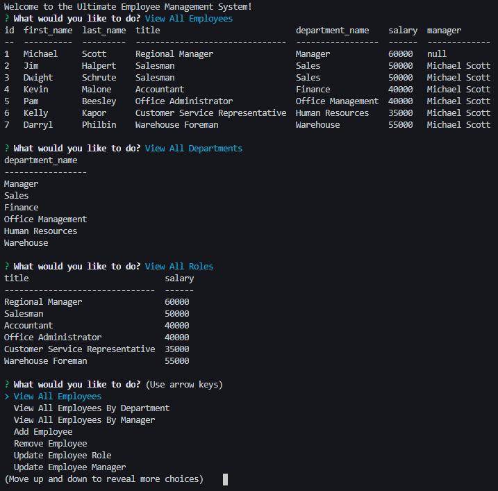

# employee-tracker

## Table of Contents
* [Description](#Description)
* [Links](#Links)
* [Design Elements](#Design-Elements)
* [App Preview](#App-Preview)
* [Credits](#Credits)

## Description
This is a command-line application that creates a content management system for all employees within a company. Users can view, add, or update departments, roles, and/or employees. This app enables business owners to easily keep track of their employees in one organized system.

### *Usage*
1. Enter "npm start" in your command line.
2. Follow the command prompts to view and update the employee management system.

## Links
* Video Walkthrough: https://drive.google.com/file/d/1IyMqLJEc22_CtAR3Shwmu4fbF42_pqzw/view
* GitHub Repository: https://github.com/zachdrummond/employee-tracker

## Design Elements
### *JavaScript - Node.js*
* Node Command-Line User Interface
* Node Package Manager - Inquirer, MySQL, Console.Table
* Promises
* Objects & Destructured Objects
* Arrays
* Methods
* Functions
* if...else Statements
* PORT
* Template Literals
* Comments

### *MySQL*
* Database
* Tables
* Columns and Rows
* Joins
* Constraints

## App Preview

## Credits
* https://nodejs.org/en/
* https://www.npmjs.com/package/inquirer
* https://dev.mysql.com/
* https://www.npmjs.com/package/console.table
* https://www.npmjs.com/package/mysql
* https://www.mysql.com/